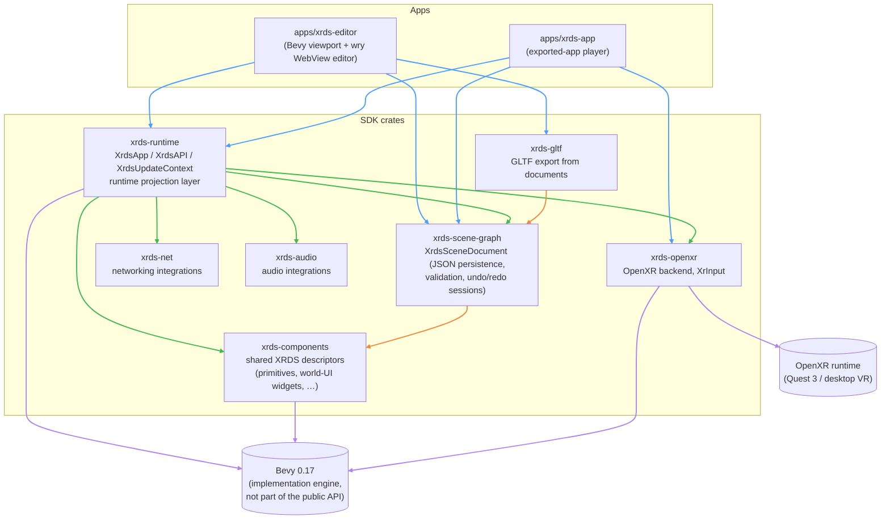
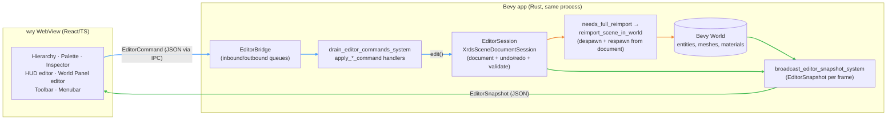
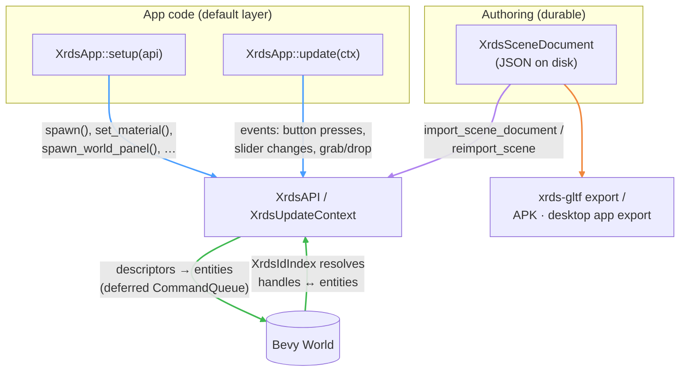
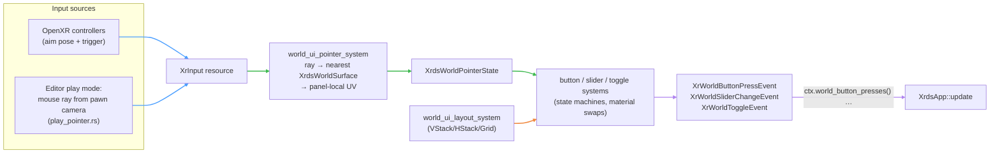

# DeviceSDK Architecture

This repository is organized around a layered SDK model so non-experts can build XR apps without dropping into engine internals, while advanced users still have an escape hatch.

## Architecture Overview (Diagrams)

### Workspace crates and apps



Arrow colours: **blue** = app → SDK, **green** = `xrds-runtime` → sibling crates,
**orange** = other intra-SDK deps, **purple** = external engines.

### Editor: WebView ⇄ Bevy bridge

The editor is a single process: a Bevy app renders the 3-D viewport into the OS window,
and a wry WebView (React) draws the UI around a "hole" cut over the viewport area.
The two sides talk through in-process queues — there is no HTTP server.



Arrow colours: **blue** = inbound commands, **orange** = document → world reimport,
**green** = per-frame snapshot back to the UI.

### Scene data flow: document-first and runtime-first



Arrow colours: **purple** = document-first import, **blue** = runtime-first app calls,
**green** = API ⇄ world, **orange** = export.

### World-space UI input path (runtime)



Arrow colours: **blue** = input sources, **green** = pointer → widget chain,
**orange** = layout, **purple** = events to app code.

## SDK Layering (Most Important)

### 1) Default SDK Layer (app-facing)

Primary types:

- `XrdsApp`
- `XrdsAPI`
- `XrdsUpdateContext`

Responsibilities:

- spawn/update scene content through XRDS descriptors and handles
- drive scene-wide runtime policy (for example environment policy)
- keep normal app code independent from direct Bevy ECS/system wiring

Design intent:

- this is the main supported path for most users
- new features should be surfaced here first when possible

### 2) Expert Layer (engine-facing)

Primary types:

- `RuntimeHandler`
- direct Bevy systems/components/resources

Responsibilities:

- advanced engine control and custom integration points
- low-level rendering/runtime behavior when XRDS abstractions are not enough

Design intent:

- optional escape hatch, not the default development model
- `xrds` does not re-export Bevy; expert code imports Bevy directly

### 3) Document/Authoring Layer (durable scene model)

Primary crate and types:

- `xrds-scene-graph`
- `XrdsSceneDocument`, `XrdsSceneNode`, asset catalog/document editing APIs

Responsibilities:

- save/load JSON scene documents
- durable ids, hierarchy, metadata, and validation
- import/export boundary between authored scene meaning and runtime state

How it relates to SDK layering:

- authoring data is edited in document APIs
- runtime behavior is realized through `XrdsAPI` in `xrds-runtime`

## Crate Roles (Brief)

- `xrds` (root crate): SDK entry surface and workspace integration layer.
- `xrds-runtime`: runtime projection layer that realizes XRDS concepts in the live engine.
- `xrds-scene-graph`: document model, persistence, and authored workflow operations.
- `xrds-components`: shared XRDS component descriptors/types used by runtime and SDK surfaces.
- `xrds-openxr`: OpenXR backend integration.
- `xrds-net`: networking-related runtime integrations/samples.
- `xrds-audio`: audio-related runtime integrations.

## Data Flow

Two common paths are intentionally supported:

1. Runtime-first: app logic calls `XrdsAPI` directly for live scene control.
2. Document-first: author in `XrdsSceneDocument`, then import through runtime APIs.

Both paths converge in `xrds-runtime`, which applies XRDS-authored policy/components to the live world.

## Current Environment Policy Example

Scene environment policy currently supports IBL, skybox, manual exposure, and linear fog.

- Document-driven: author in `XrdsSceneDocument`, import into runtime.
- Runtime-driven: call `merge_scene_assets(...)`, `set_scene_environment(...)`, and `clear_scene_environment(...)`.

## Trigger-Action Sequencing

Lets an authored scene say "when trigger T fires on this node, run this
ordered list of actions" — without a scripting language, a visual
node-graph, or any codegen. Design rationale:
`docs/done/xrds-scenegraph-trigger-action-sequencing.md`.

**Two collaborating but separate systems:**

1. **Trigger-action** — an open, pluggable mechanism. Any message type can
   fire a sequence by implementing `XrdsTriggerEvent` (`target()` =
   whose bindings to check, `source()` = what caused it, `kind()`), then
   registering one `consume_triggers::<E>` system. Adding a new trigger
   source costs one trait impl plus one registration — the data model
   doesn't change. Eleven sources ship today: `ZoneEnter`/`ZoneExit`,
   `Grabbed`/`Dropped`, `HoverEnter`/`HoverExit`,
   `ButtonPress`/`ButtonRelease`, `SliderChange`, `ToggleChange`, and
   `AnimationComplete`. Plus `Custom(String)` for app-defined triggers.

   `AnimationComplete` is how "play an animation, *then* do X" is
   expressed: put the follow-up in a second binding rather than having the
   first sequence block. It never fires for `Loop` playback (no
   completion) nor for an explicit stop.

**Continuous state is deliberately not modeled as triggers.** Values like
rotation angle, position, or scale have no natural "moment" — they change
every frame — and the threshold that makes one *matter* is domain
knowledge the SDK cannot have (45° is meaningful for a valve puzzle and
meaningless for a spinning fan). No mainstream engine models this
declaratively either. Instead: gameplay code watches the value, decides
when it matters, and fires an `XrdsTriggerKind::Custom` trigger. That's
also the pattern for anything the built-in vocabulary doesn't cover —
define a message, implement `XrdsTriggerEvent`, register
`consume_triggers::<E>`, no SDK change required. `Custom` is the inbound
counterpart to `XrdsAction::FireCustomEvent`.
2. **Sequencing** — an ordered action queue built on
   `bevy-sequential-actions`. **Each firing spawns its own ephemeral agent
   entity**, despawned when its queue drains. This is deliberate: two
   different sources firing the same trigger are independent events and
   run concurrently rather than queueing behind each other, matching
   Unity/Unreal/Godot's convention that the detection layer never
   suppresses.

**Authoring (document layer, `xrds-scene-graph`):** `XrdsSceneNode` has a
top-level `triggers: Vec<XrdsTriggerBinding>` field — deliberately *not*
nested inside `XrdsInteractionZone`, so any node can carry bindings
regardless of payload kind (a plain physics body can react to a collision
trigger without being an interaction zone). `#[serde(default)]`, so older
saved documents load unaffected.

```rust
XrdsSceneNode {
    // ...
    triggers: vec![XrdsTriggerBinding {
        trigger: XrdsTriggerKind::ZoneEnter,
        sequence: XrdsSequence {
            steps: vec![
                XrdsAction::SetVisible(false),
                XrdsAction::Wait { seconds: 0.35 },
                XrdsAction::SetVisible(true),
                XrdsAction::Teleport { destination: [1.5, 0.5, 0.0] },
            ],
        },
    }],
}
```

`XrdsAction` is a **closed vocabulary** — that's what keeps this from
becoming a scripting language. v1: `PlayGltfAnimation`,
`StopGltfAnimation`, `SetVisible`, `Teleport`, `ModifyHealth`, `Wait`,
`FireCustomEvent`. Candidate future variants (audio, materials, physics,
networking) are parked in `docs/xrds-trigger-action-backlog.md`.

**Scope boundary:** this layer applies short, parameterized effects. It is
*not* a game-logic engine — gameplay state, physics, input, AI, and
anything needing to branch on live state stay as ordinary Bevy
systems. If a sequence wants `if HP < 20% then X else Y`, that's the
signal to use `FireCustomEvent` and handle it in the expert layer rather
than growing `XrdsAction`.

**Dynamic values:** `XrdsActionValue::FromTriggerSource` reads a generic
`XrdsTriggerValue(f32)` component off the triggering entity — gameplay
code populates it (e.g. a bullet's fire-system setting its damage), this
layer only reads it. Missing slot degrades to `0.0` with a warning, never
a panic.

Runnable example: `examples/xrds_first/trigger_action_sequence.rs`.
