# XRDS Examples

Run an example with:

```bash
cargo run --example <example_name>
```

`<example_name>` is always just the file stem (e.g. `simple_api`, not
`xrds_first/simple_api`) — every example name is unique across categories,
so this works regardless of which subfolder it lives in.

## Directory layout

Examples are grouped into category subfolders, matching the sections
below:

| Folder | Section |
| --- | --- |
| [`xrds_first/`](xrds_first/) | XRDS-First Examples |
| [`extensions/`](extensions/) | Extension-First Examples |
| [`networking/`](networking/) | Extension-First Examples (xrds-net) |
| [`webrtc/`](webrtc/) | Extension-First Examples (WebRTC) — see [webrtc/README.md](webrtc/README.md) for a launching manual, especially for the standalone `webrtc_realnet_*` binaries |
| [`expert/`](expert/) | Expert Escape Hatch |
| [`rendering/`](rendering/) | Rendering And Feature Demos |

Cargo's example autodiscovery doesn't recurse into subfolders like this,
so each one has an explicit `[[example]]` entry in the workspace root
`Cargo.toml`. If you add a new example file, add its entry there too (or
`cargo run --example <name>` won't find it).

## Start Here

If you are new to XRDS, start with these in order:

1. [simple_api.rs](xrds_first/simple_api.rs): the simplest XRDS-first runtime path with built-in cameras, lights, geometry helpers, and update context helpers.
2. [runtime_scene_environment.rs](xrds_first/runtime_scene_environment.rs): the smallest runtime-first path for scene-wide environment policy through `XrdsAPI`.
3. [environment_map_visual_check.rs](xrds_first/environment_map_visual_check.rs): a fast visual proof that scene environment maps are reaching reflections and skybox.
4. [simple_scene.rs](xrds_first/simple_scene.rs): a compact authored scene built from XRDS descriptors.
5. [simple_update.rs](xrds_first/simple_update.rs): frame-to-frame runtime mutation through XRDS handles.
6. [scene_document_import.rs](xrds_first/scene_document_import.rs): importing an authored `XrdsSceneDocument` into live runtime state.
7. [editor_basement_flow.rs](xrds_first/editor_basement_flow.rs): editing a document through `XrdsSceneDocumentSession`, importing it, then applying runtime commit helpers to the imported handles.
8. [scene_document_export.rs](xrds_first/scene_document_export.rs): importing authored scene data, committing runtime XRDS edits, and exporting the result back into a scene document snapshot.
9. [scene_document_session_save_load.rs](xrds_first/scene_document_session_save_load.rs): saving a scene document session to JSON and loading it back through `XrdsSceneDocumentSession`.

These examples teach the intended default path: author in XRDS concepts, keep the document model outside the runtime, and use `XrdsAPI` as the runtime projection layer.

Important rule about ids:

- If you are writing runtime-first SDK code, prefer the typed `Handle<T>` returned by `api.spawn(...)` and let XRDS allocate ids for you.
- If you are writing document import/export code, explicit ids belong to the scene document because they are part of the authored data model and must survive round-trips.
- The document-oriented examples show explicit ids only to demonstrate stable authored identity, not because normal XRDS runtime usage should hard-code ids.

## Common Paths At A Glance

| Goal | Primary types | Identity model | Start here |
| --- | --- | --- | --- |
| Build a live app scene quickly | `XrdsAPI`, runtime descriptors like `XrdsCamera` and `XrdsCube` | Keep typed handles returned by `api.spawn(...)` | [simple_api.rs](xrds_first/simple_api.rs) |
| Drive scene environment from live app logic | `XrdsAPI`, `XrdsSceneAsset`, `XrdsSceneEnvironment` | Runtime owns policy, scene asset ids provide durable texture references | [runtime_scene_environment.rs](xrds_first/runtime_scene_environment.rs) |
| Import or export authored scene data | `XrdsSceneDocument`, `XrdsSceneNode`, `XrdsAPI` | Stable document ids preserved across round-trips | [scene_document_import.rs](xrds_first/scene_document_import.rs), [scene_document_export.rs](xrds_first/scene_document_export.rs) |
| Save, load, and edit a durable scene document | `XrdsSceneDocumentSession` | Stable document ids owned by the document model | [scene_document_session_save_load.rs](xrds_first/scene_document_session_save_load.rs), [editor_basement_flow.rs](xrds_first/editor_basement_flow.rs) |

## XRDS-First Examples

| Example | Purpose |
| --- | --- |
| [simple_api.rs](xrds_first/simple_api.rs) | Smallest end-to-end XRDS runtime example with typed helper methods. |
| [runtime_scene_environment.rs](xrds_first/runtime_scene_environment.rs) | Runtime-first scene environment policy through `merge_scene_assets`, `set_scene_environment`, and `clear_scene_environment`, including IBL, skybox, manual exposure, and fog. |
| [environment_map_visual_check.rs](xrds_first/environment_map_visual_check.rs) | Focused visual proof that scene-wide IBL and skybox are affecting reflections across different material roughness levels. |
| [simple_scene.rs](xrds_first/simple_scene.rs) | Basic scene authored directly with XRDS descriptors. |
| [simple_update.rs](xrds_first/simple_update.rs) | Simple per-frame updates through XRDS handles. |
| [parent_child.rs](xrds_first/parent_child.rs) | Runtime hierarchy edits after spawn. |
| [parent_child_queued.rs](xrds_first/parent_child_queued.rs) | Hierarchy declared up front in queued XRDS creation flows. |
| [edit_material.rs](xrds_first/edit_material.rs) | Material editing through XRDS-authored material params. |
| [active_compo_control.rs](xrds_first/active_compo_control.rs) | XRDS-centric component control flow. |
| [load_gltf.rs](xrds_first/load_gltf.rs) | Loading authored glTF scene content through XRDS. |
| [load_gltf_fail_case.rs](xrds_first/load_gltf_fail_case.rs) | Handling glTF load failures through XRDS-facing status queries. |
| [load_gltf_animated.rs](xrds_first/load_gltf_animated.rs) | Animated counterpart to `load_gltf.rs` — loads an animated glTF via `XrdsGltfAsset`/`XrdsAPI` and starts its animation from `update()`. |
| [scene_document_import.rs](xrds_first/scene_document_import.rs) | Importing scene-graph document data into live runtime entities. |
| [scene_document_environment_import.rs](xrds_first/scene_document_environment_import.rs) | Small XRDS-first import example for authored scene-level IBL environment metadata. |
| [scene_document_texture_uv_rotation_only.rs](xrds_first/scene_document_texture_uv_rotation_only.rs) | Minimal authored-scene proof that texture UV rotation is center-based by default. |
| [scene_document_texture_uv_validation.rs](xrds_first/scene_document_texture_uv_validation.rs) | Control-versus-proof render example for authored texture UV transforms and sampler settings. |
| [scene_document_audio_workflow.rs](xrds_first/scene_document_audio_workflow.rs) | Scene-document audio asset catalog and `XrdsSceneAudioClip` node workflow — non-spatial and spatial/panning clips authored through `XrdsSceneDocument`/`XrdsSceneDocumentSession`. |
| [scene_document_material_workflow.rs](xrds_first/scene_document_material_workflow.rs) | Authoring/importing a scene document with PBR material params (`XrdsSceneMaterial`, alpha-blend, double-sided) and live-editing emissive color at runtime via `XrdsAPI`. |
| [editor_basement_flow.rs](xrds_first/editor_basement_flow.rs) | End-to-end editor-basement flow: document session edits, runtime import, and queued runtime commit helpers. |
| [scene_document_export.rs](xrds_first/scene_document_export.rs) | Export-focused XRDS flow: runtime edits committed through XRDS and exported back into a document snapshot. |
| [scene_document_session_save_load.rs](xrds_first/scene_document_session_save_load.rs) | Document-only session workflow: save JSON, edit, save in place, and reload through `XrdsSceneDocumentSession`. |
| [descriptor_gen.rs](xrds_first/descriptor_gen.rs) | Minimal descriptor-authoring demo: spawns a camera, ambient light, and cube purely through `XrdsAPI`/`XrdsApp::setup`. |
| [glb_runtime_add.rs](xrds_first/glb_runtime_add.rs) | Runtime GLB placement: adds/removes a `.glb` at runtime via a keypress, entirely through `XrdsSceneDocumentSession`/scene-graph node ids. |
| [trigger_action_track.rs](xrds_first/trigger_action_track.rs) | Tracks: one trigger choreographing several nodes at once — a looping Track with one row per asset, concurrent keys on the same tick, and a second Track refused because its assets are already claimed. Replaces the former `trigger_action_sequence` and `trigger_action_timeline` examples, whose sequence-versus-timeline contrast the Track model dissolved. |

## Extension-First Examples

These show the open extension model. Use them when built-in XRDS components are not enough and you need custom descriptors or custom patch behavior.

| Example | Purpose |
| --- | --- |
| [generic_update.rs](extensions/generic_update.rs) | Custom descriptor plus custom patch type while still realizing through XRDS-owned geometry/material paths. |
| [net_app.rs](networking/net_app.rs) | **Networking inside an `XrdsApp`** — the recommended in-app path. Kicks off a one-shot (`request_async` → poll with `Option<XrdsNetTask>::take_ready()`) and an ongoing stream (`NetFeed::try_recv`/`take_error`) from `setup`/`update`, all off the frame thread. Start here if you're networking from a running app. |
| [net_intent.rs](networking/net_intent.rs) | The same four intent verbs (`request`/`dispatch`/`listen`/`transfer`) called **synchronously**, standalone (no runtime) — fine for scripts/tests; would block a frame if used in-app. |
| [net.rs](networking/net.rs) | Expert `ClientBuilder`/`Client` session API `XrdsNet` is built on — protocol-aware (`set_protocol`, `.connect()`/`.request()`/`.send()`/`.rcv()`) for when you need lower-level control. |
| [net_protocols.rs](networking/net_protocols.rs) | Focused: a **capability tour** — one supported verb per protocol (HTTP/CoAP `request`, WS `dispatch`, MQTT `dispatch`+`listen` round-trip, FTP `transfer`), all through the intent verbs. See MANUAL.md §12. |
| [net_errors.rs](networking/net_errors.rs) | Focused: the structured **`NetError`** model — one case per variant (`UnrecognizedScheme`/`Capability`/`MissingInput`/`Network`/`Protocol`) and how to react. Mostly network-free. See MANUAL.md §6. |
| [net_backpressure.rs](networking/net_backpressure.rs) | Focused: **`listen` buffering** — `ListenOptions` + `Overflow` (lossless `Block` vs live `DropOldest`), the knob a video-rate feed needs. See MANUAL.md §7. |
| [webrtc_webcam_stream.rs](webrtc/webrtc_webcam_stream.rs) | Live webcam + microphone streamed over WebRTC — `xrds-media` owns device access, `xrds-net` only transcodes/transports the injected `VideoSource`/`AudioSource`. |
| [webrtc_file_stream.rs](webrtc/webrtc_file_stream.rs) | The same WebRTC signaling/ICE/media path, but publishing a bundled sample file instead of a real webcam+mic — no hardware needed, runs anywhere. Also demonstrates a data channel message, OS-assigned signaling port, loopback-only ICE config, and clean peer-connection teardown. Start here to see the WebRTC API without needing a camera. |
| [webrtc_realnet_signaling_server.rs](webrtc/webrtc_realnet_signaling_server.rs), [webrtc_realnet_publisher.rs](webrtc/webrtc_realnet_publisher.rs), [webrtc_realnet_subscriber.rs](webrtc/webrtc_realnet_subscriber.rs) | Three standalone binaries for testing WebRTC across a **real** network (not loopback) — e.g. two separate machines. Unlike the examples above, these use the default production STUN/TURN config and print the ICE connection state plus the winning candidate pair type (`host`/`srflx`/`relay`) so you can confirm whether a TURN relay was actually used. **See [webrtc/README.md](webrtc/README.md) for the full launching manual** (flags, multi-terminal order, TURN credentials, troubleshooting). |

## Expert Escape Hatch

These examples are useful, but they are not the recommended first contact for non-experts or future editor-facing integrations.

They import Bevy directly on purpose. XRDS no longer re-exports Bevy for them.

| Example | Layer | Purpose |
| --- | --- | --- |
| [direct_bevy.rs](expert/direct_bevy.rs) | `Direct-Bevy` | Direct Bevy scene construction and animation inside an XRDS runtime shell. Use this when XRDS abstractions are intentionally not the goal. |

## Rendering And Feature Demos

These are primarily feature showcases rather than editor-basement teaching examples.

For texture UV authoring specifically, start with [scene_document_texture_uv_rotation_only.rs](xrds_first/scene_document_texture_uv_rotation_only.rs). It isolates the authored rotation behavior without extra offset or sampler changes. Use [scene_document_texture_uv_validation.rs](xrds_first/scene_document_texture_uv_validation.rs) when you want the broader proof that authored UV metadata and sampler metadata both survive document import and reach the runtime material path.

For scene-level environment authoring, start with [scene_document_environment_import.rs](xrds_first/scene_document_environment_import.rs). It authors scene-wide environment metadata on the document, imports it through `XrdsAPI`, and shows the imported camera picking up IBL, manual exposure, and fog automatically.

For a quick visual check that your environment maps are actually landing in the runtime material path, run [environment_map_visual_check.rs](xrds_first/environment_map_visual_check.rs). It keeps the scene small and compares three spheres with different roughness so reflection sharpness is easy to judge by eye.

For scene-level environment control owned by the live application instead of a document, start with [runtime_scene_environment.rs](xrds_first/runtime_scene_environment.rs). It merges durable texture asset ids into the runtime catalog, sets scene-wide IBL, skybox, manual exposure, and fog directly through `XrdsAPI`, then clears and restores that policy while the app is running.

For strict layering, treat the label below as authoritative:

- `XRDS-first`: the scene is primarily authored through `XrdsAPI` and XRDS descriptors, even if a small Bevy bridge is still needed.
- `Direct-Bevy`: the demo is primarily about Bevy render, animation, post-process, mesh, or camera APIs. XRDS may still host the runtime shell, but it is not the teaching surface.

| Example | Layer | Why It Is Labeled That Way | Screenshot |
| --- | --- | --- | --- |
| [2d_bloom.rs](rendering/2d_bloom.rs) | `Direct-Bevy` | Uses Bevy 2D camera, bloom, tonemapping, meshes, and materials directly through `Commands`. | 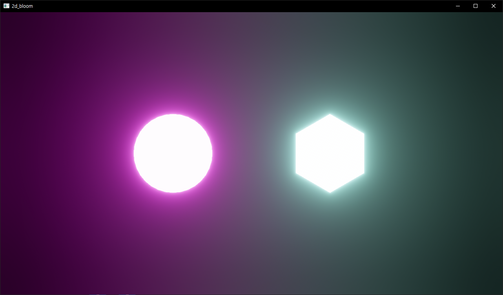 |
| [2d_shapes.rs](rendering/2d_shapes.rs) | `Direct-Bevy` | Pure Bevy 2D shapes and camera setup; XRDS is not the authoring surface. | 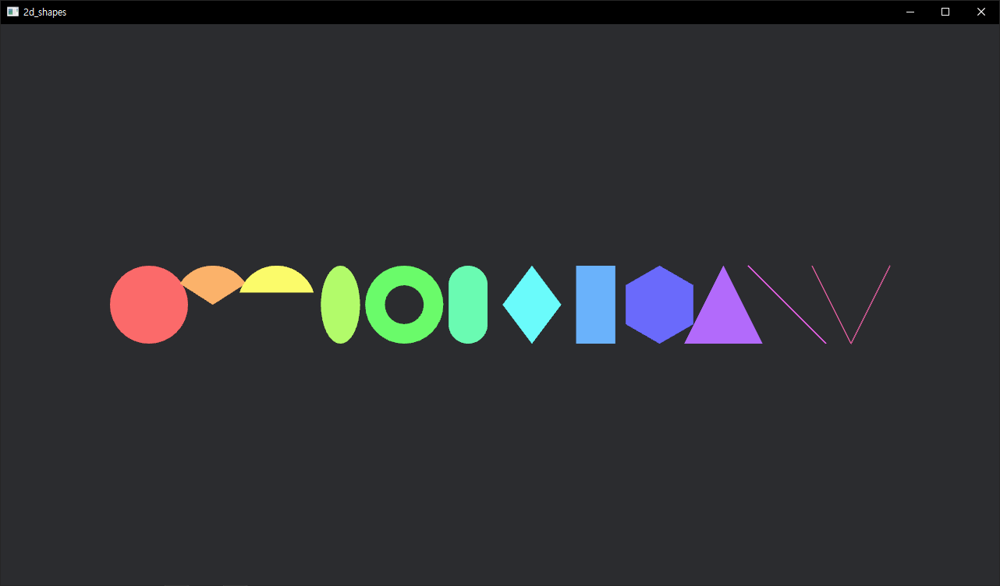 |
| [3d_bloom.rs](rendering/3d_bloom.rs) | `XRDS-first` | Uses XRDS camera, XRDS spheres, and XRDS material/emissive helpers as the primary scene API. | 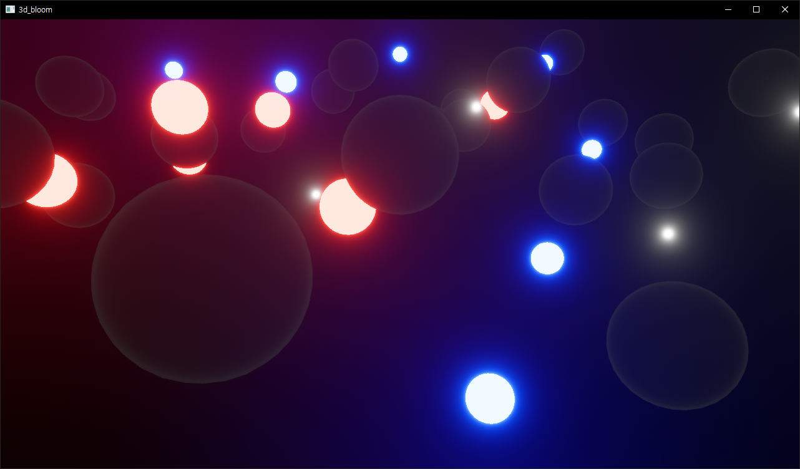 |
| [3d_shapes.rs](rendering/3d_shapes.rs) | `Direct-Bevy` | Demonstrates Bevy mesh generation, textures, and `StandardMaterial` usage directly. | 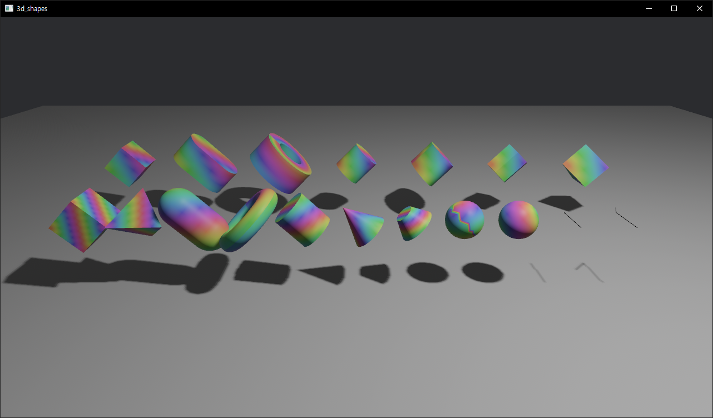 |
| [atmospheric_fog.rs](rendering/atmospheric_fog.rs) | `Direct-Bevy` | Fog, shadow, glTF scene loading, and sky material setup are all done with Bevy rendering APIs. | 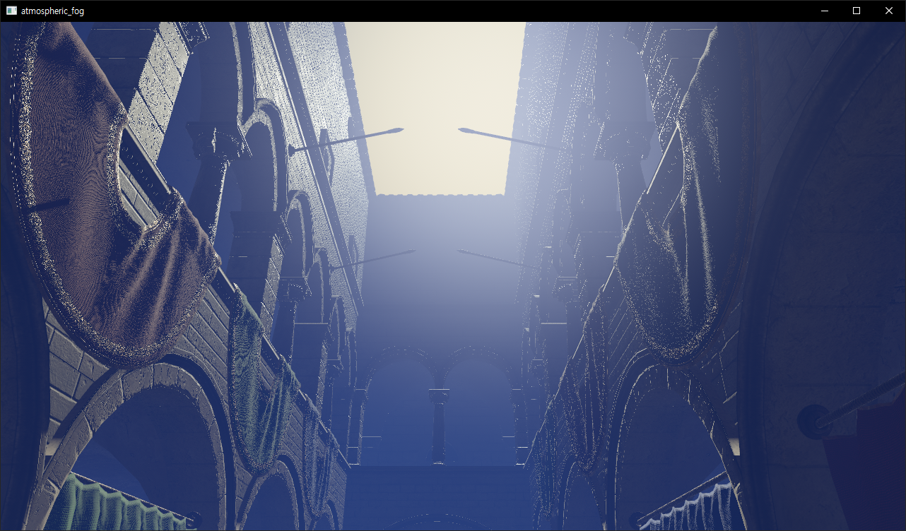 |
| [custom_skinned_mesh.rs](rendering/custom_skinned_mesh.rs) | `Direct-Bevy` | Skinning, joints, mesh assets, and animated hierarchy are authored directly with Bevy ECS/render types. | 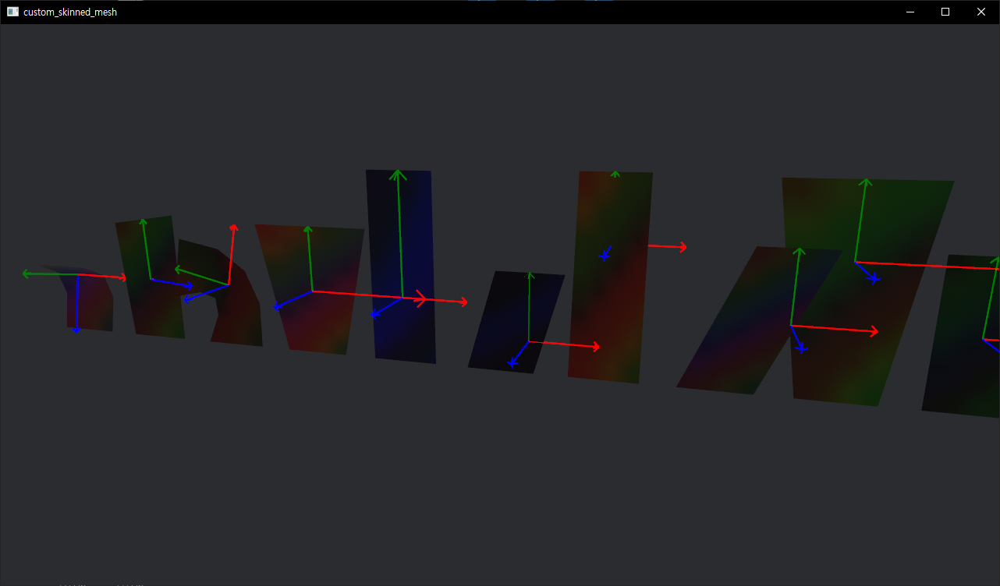 |
| [light_transmission.rs](rendering/light_transmission.rs) | `Direct-Bevy` | The example is centered on Bevy lighting and material configuration, not XRDS descriptors. | 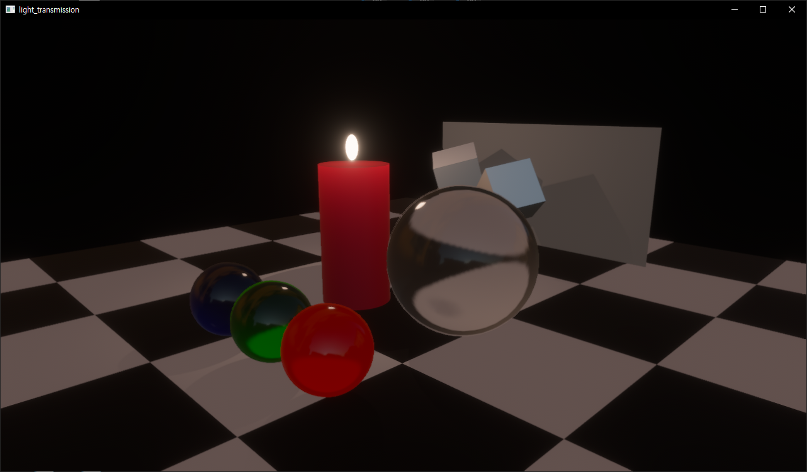 |
| [morph_targets.rs](rendering/morph_targets.rs) | `XRDS-first` | Loads the morph-target glTF through XRDS and starts playback through the XRDS animation API, so the default teaching surface remains `XrdsAPI` rather than direct Bevy animation wiring. | 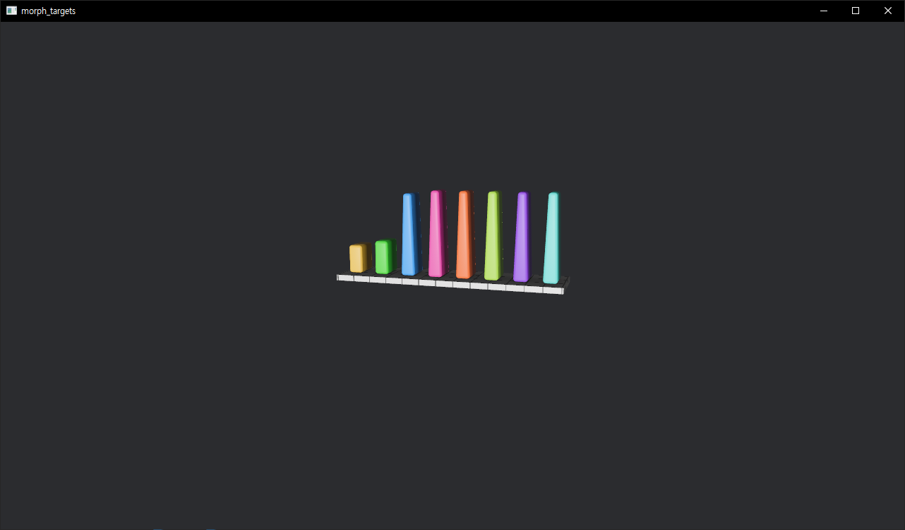 |
| [physical_based_rendering.rs](rendering/physical_based_rendering.rs) | `Direct-Bevy` | PBR grid setup, environment maps, orthographic projection, and labels are all authored directly in Bevy. | 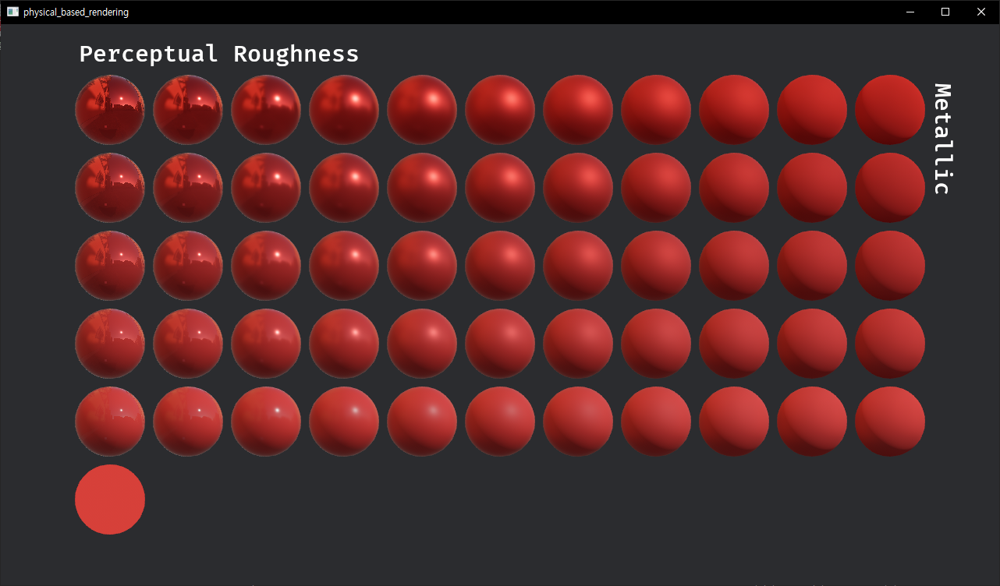 |
| [postprocessing_builtin.rs](rendering/postprocessing_builtin.rs) | `Direct-Bevy` | Post-processing configuration and scene setup use Bevy camera/material APIs directly. | 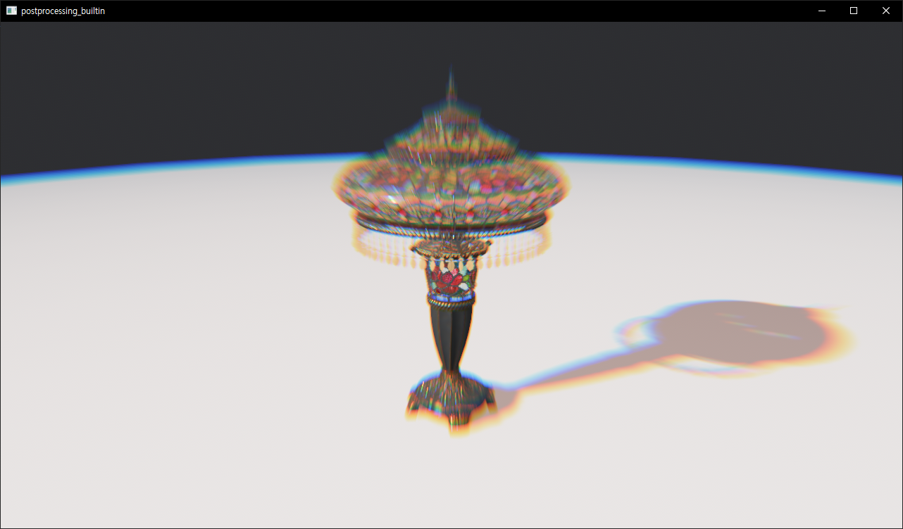 |
| [simple_xr_scene.rs](rendering/simple_xr_scene.rs) | `XRDS-first` | Scene content is authored through XRDS descriptors; Bevy is only used for the explicit `OpenXrCamera` startup bridge. | 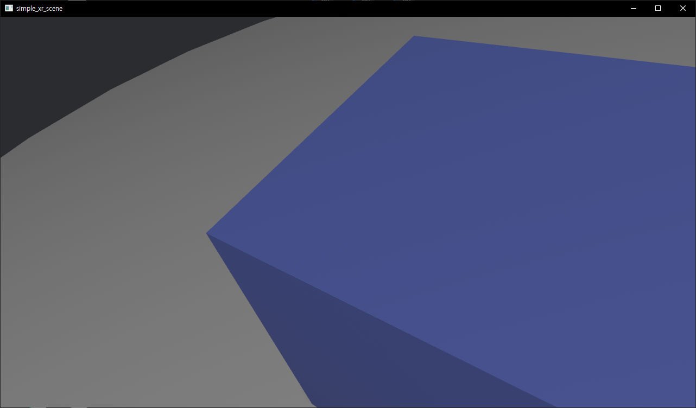 |
| [skybox.rs](rendering/skybox.rs) | `Direct-Bevy` | Skybox, TAA, SSAO, cubemap resource management, and lighting are all Bevy-first rendering concerns. | 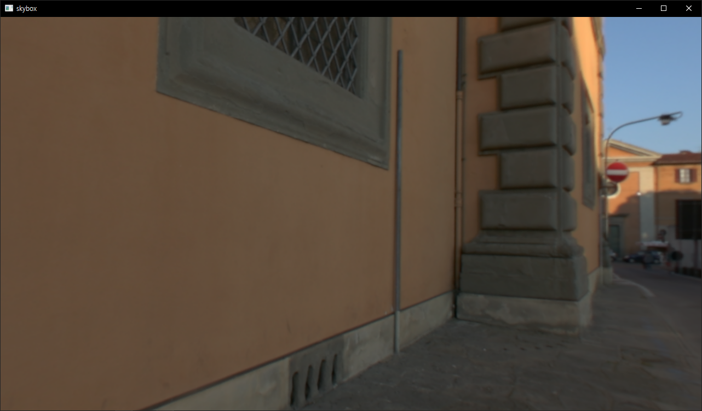 |
| [spherical_area_lights.rs](rendering/spherical_area_lights.rs) | `Direct-Bevy` | Area lights, meshes, and materials are configured directly with Bevy render components. | 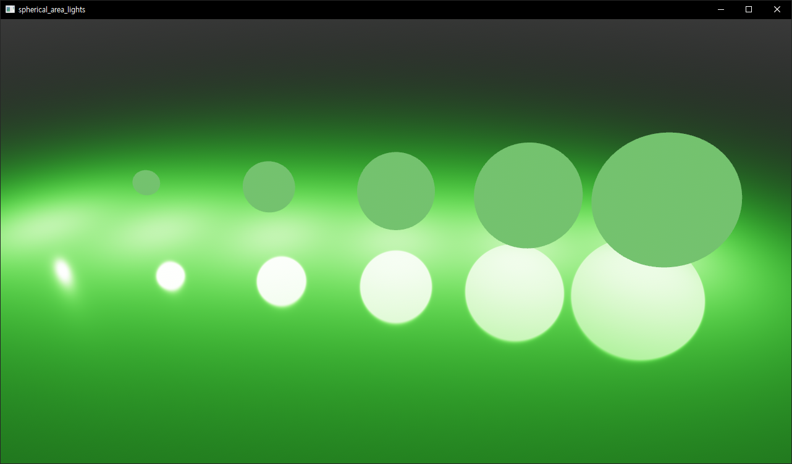 |
| [split_screen.rs](rendering/split_screen.rs) | `Direct-Bevy` | Viewports, multiple cameras, UI overlays, and mesh/material setup are all direct Bevy APIs. | 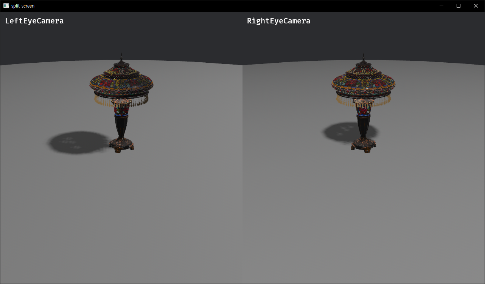 |
| [two_pass.rs](rendering/two_pass.rs) | `Direct-Bevy` | The point of the example is multi-camera render ordering, implemented directly with Bevy camera APIs. | 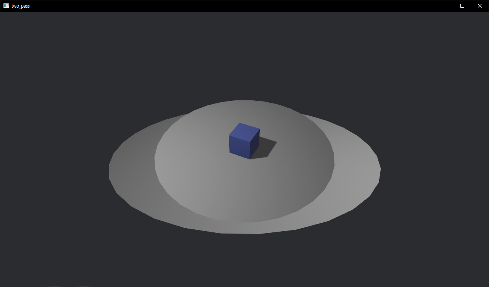 |
| [vertex_color.rs](rendering/vertex_color.rs) | `Direct-Bevy` | Vertex attribute mutation, mesh construction, and material handling are authored directly with Bevy mesh APIs. | 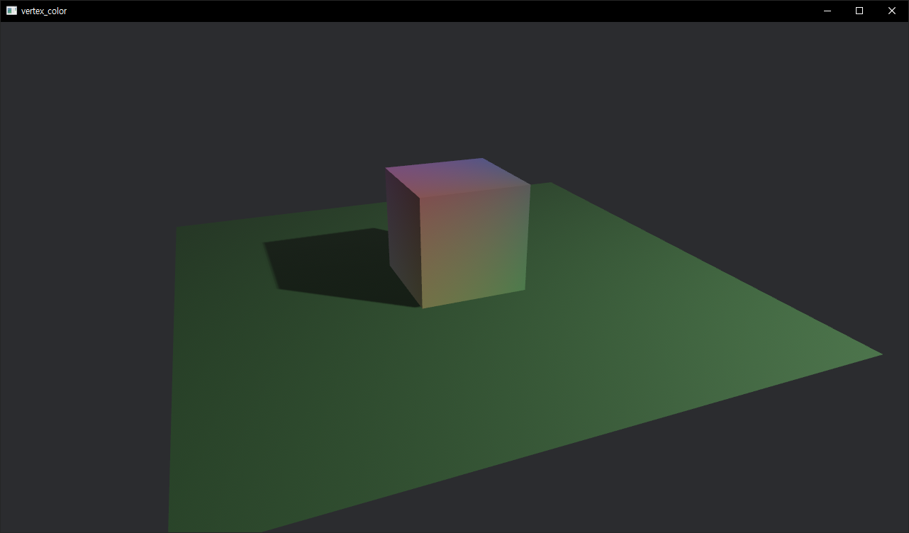 |
| [3d_text.rs](rendering/3d_text.rs) | `XRDS-first` | Flat/billboard 3D text authored through `XrdsText`/`TextParams`; the FPS-style camera controller is incidental Bevy input glue, not the teaching surface. | — |
| [extruded_text.rs](rendering/extruded_text.rs) | `XRDS-first` | Extruded (embossed) 3D text authored through `XrdsExtrudedText`, same camera controller as `3d_text.rs`. | — |
| [gltf_samples_check.rs](rendering/gltf_samples_check.rs) | `Direct-Bevy` | Diagnostic tool: loads GLB files directly through Bevy's native `GltfLoader`/`AssetServer` and reports load status/errors, bypassing XRDS entirely. | — |
| [original_morph.rs](rendering/original_morph.rs) | `Direct-Bevy` | Plays a glTF animation with morph targets and prints morph-target names using raw Bevy `AnimationGraph`/`SceneInstanceReady` observers, no XRDS involvement. | — |

## Picking The Right Surface

- Prefer XRDS-first examples when you want application-level scene construction, document import, inspector-style runtime edits, or future editor integration.
- Prefer extension-first examples when you need custom descriptors but still want XRDS to own realization and update flow.
- Prefer the expert escape hatch only when direct Bevy control is intentional and you do not want XRDS to be the primary abstraction.
